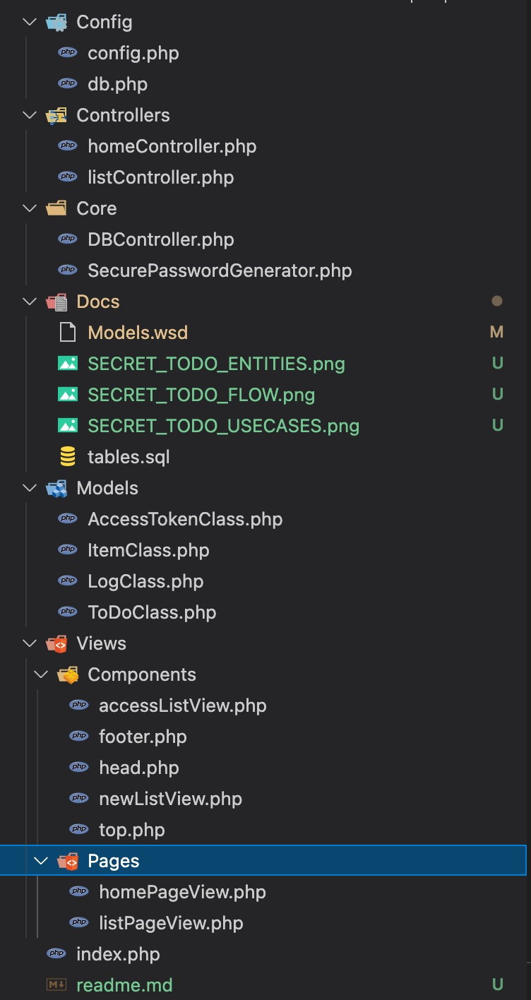
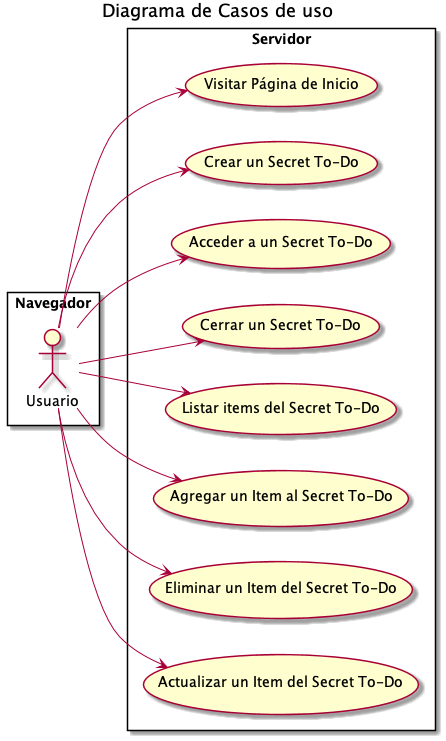
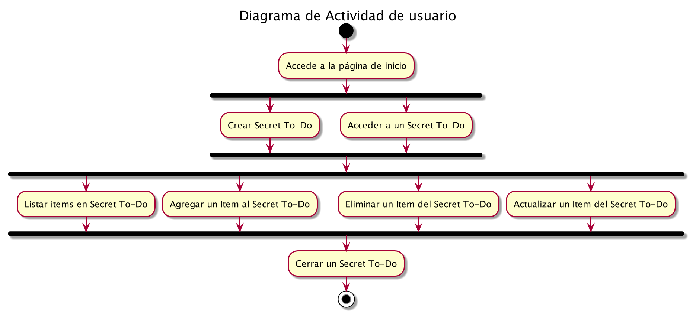
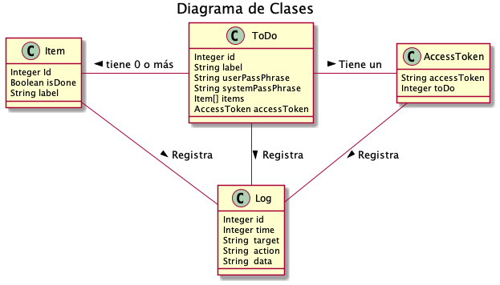

# Unir Secret To-Do
El presente proyecto corresponde a la actividad 3 **"Laboratorio: Manejo de datos en el servidor e interacción con el cliente mediante una aplicación web"** de la Materia de **"Computación en el Servidor Web"** del primer semestre de la **Maestría en Ingeniería de Software y Sistemas Informáticos**.

El proyecto desarrolla un aplicativo sencillo de lista ToDo con la característica de acceder a traves de un secreto generado por el usuario (password) y un secreto generado por el servidor (ID). Se desarrolló utilizando el patrón MVC.

Aplica los conceptos de los temas de la materia como son:

* Manejo de sesiones para persistir el acceso al listado por parte del usuario

* Manejo de formularios y métodos GET, utilizados para manejar las rutas, acciones y vistas de la aplicación

* Manejo de formularios y métodos POST, utilizados para el envío de información desde el browser

* Manejo de Programación orientada a objetos y diseño de clases 

* Tratamiento de datos del lado del servidor con la integración de un Motor de Base de Datos MySQL

El demo de este proyecto lo uedes consultar en: 
https://tirso-unir-todo.webcindario.com/

---

El proyecto integra en la carpeta Doc las tablas necesarias para la base de datos, los modelos de casos de uso, actividad y de las entidades en el archivo Models.wsd utilizando el DSL plantUML.

los parámetros de la Base de datos deben ser ingresados en el archivo Config/db.php

La secuencia de actividad del usuario se da como se muestra en la imagen:

El proyecto implementa 4 entidades :
* ToDo : Lista de Tareas por Hacer
* Item : Tarea
* AccessToken: Token de acceso a una lista que es requerido para autenticar ante el backend
* Log: Registro de acciones

---

